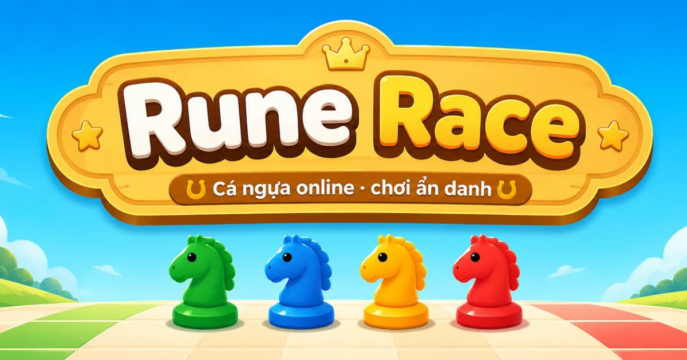
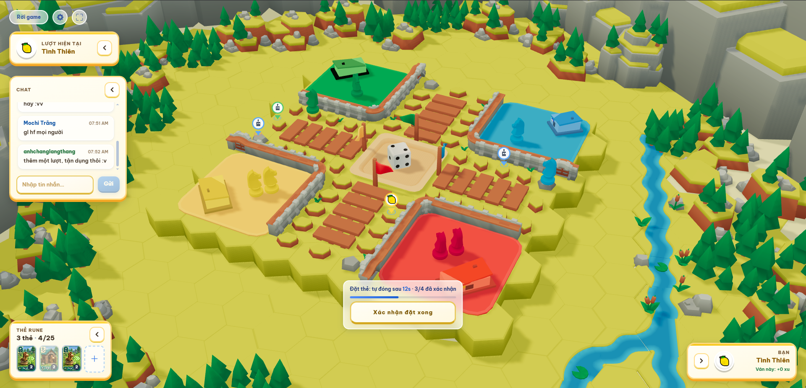
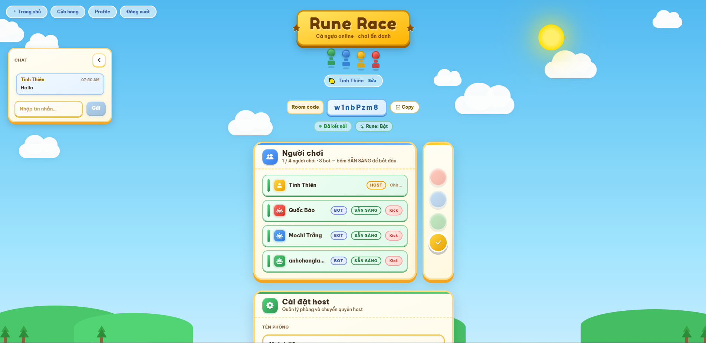
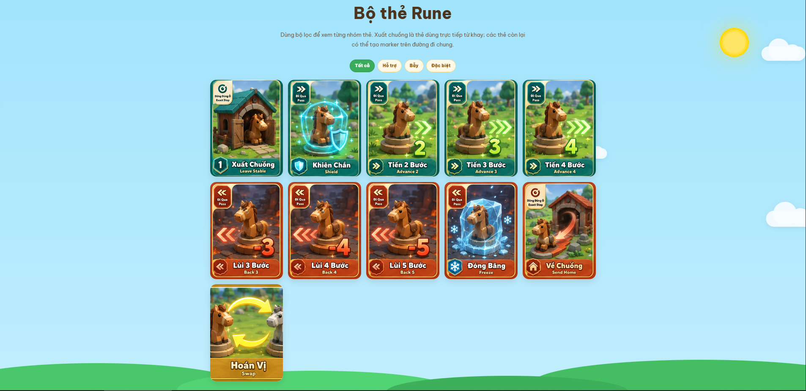

# Rune Race



**The classic horse race — with secret Runes, bluffs, and 3D chaos.**

Race your horses home in a modern online take on Ludo / Parcheesi. Draw powerful Rune cards, plant invisible traps on the track, and spoof who placed them so nobody knows who to trust.

**Play now:** [https://rune-race.onrender.com](https://rune-race.onrender.com)

---

## Screenshots





## Why play

- **Familiar race, sharper tactics** — roll, leave the stable, kick rivals home… then layer Runes on top.
- **Secret markers** — place support boosts or nasty traps without revealing the card type.
- **Spoofed identity** — pin someone else’s face on your marker and watch the table spiral.
- **Live multiplayer** — create a room, invite friends, or jump in with bots.
- **3D board** — watch every hop and Rune trigger unfold on a living board.

## How a match feels

1. Join a lobby and pick your seat.
2. On your turn, draw Runes into your hand.
3. Everyone who still holds placeable cards can drop markers at once.
4. Roll the dice, move step by step, and pray you didn’t just walk into a Freeze.
5. First to bring both horses home wins.

Full design rules: [`docs/rune-specs.md`](./docs/rune-specs.md) · early concept notes: [`docs/proposal.md`](./docs/proposal.md)

## Self-hosting (quick start)

Run the full stack locally:

**Requirements:** Node.js ≥ 20, [pnpm](https://pnpm.io) ≥ 11, and a [Supabase](https://supabase.com) project (Auth + Postgres).

```bash
git clone https://github.com/<your-org>/rune-race.git
cd rune-race
cp .env.example .env
# Fill Supabase + origin values in .env
pnpm install
pnpm dev
```

Then open:

| Service | URL |
|---------|-----|
| Web client | http://localhost:5173 |
| Game server | http://localhost:3000 |
| Admin (optional) | http://localhost:5174 |

For production on Render (static web + API/WebSocket), see [`DEPLOY.md`](./DEPLOY.md) and [`render.yaml`](./render.yaml).

## Monorepo layout

```
apps/web          # React + Vite + React Three Fiber client
apps/server       # Fastify + Socket.IO API
apps/admin        # Operator console
packages/shared   # Shared types & protocol
packages/game-engine
packages/bot-ai
```

Tech overview: [`docs/techstack.md`](./docs/techstack.md)

## Team

Rune Race is built by **JJ & Co.** for FPTU's Experiential Entrepreneurship (EXE201) program.

| Name | Role |
|------|------|
| Lê Phương Linh Nga | Leader |
| Bùi Việt Dũng | Developer |
| Nguyễn Thành Vinh | Resource Manager |
| Trần Thủy Bình | Tester |
| Doãn Thị Hà Trang | Marketing |
| Trần Thị Việt Hà | Marketing |

**Supporters:** Đặng Phúc Khanh · Khánh Phạm · Bùi Minh Đăng (AKA) · Dương Trọng Khánh · Bùi Thị Bắp (a cute cat)

Contact: [runerace.team@gmail.com](mailto:runerace.team@gmail.com)

## Disclaimer

**[https://rune-race.onrender.com](https://rune-race.onrender.com) is the only official hosted Rune Race instance.**

This repository is provided **as-is**, without warranty of any kind. JJ & Co. is not responsible for availability, security, data handling, or behavior of any other self-hosted or third-party deployments built from this code.

## License

[GNU GPL v3](./LICENSE)
