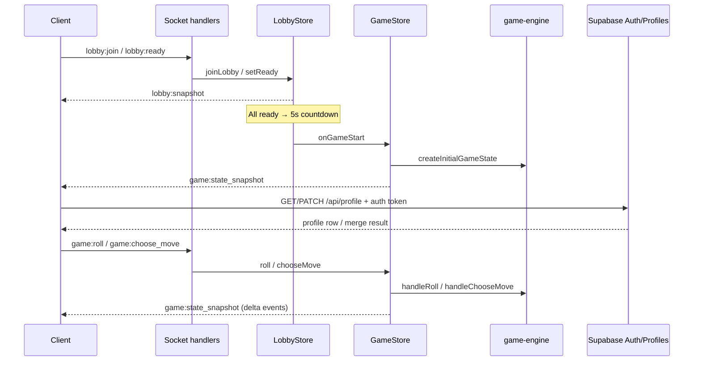

# Server architecture

## Source layout

```
apps/server/src/
├── index.ts              # Fastify + Socket.IO bootstrap
├── http/
│   ├── auth.ts           # Link anon profile into signed-in account
│   ├── matchmaking.ts    # Matchmaking queue + routes
│   ├── profile.ts        # Public profile fetch + owner update
│   └── rooms.ts          # GET/POST /api/rooms
├── socket/
│   ├── handlers.ts           # All lobby:* and game:* socket handlers
│   └── player-socket-registry.ts  # playerId → sockets (kick / removal notify)
├── lobby/lobby-store.ts  # Lobby lifecycle, ready/countdown, host actions
├── game/game-store.ts    # Game sessions; delegates to game-engine
└── lib/
    ├── auth.ts           # Bearer token parsing + Supabase user lookup
    ├── join-code.ts      # 8-char case-sensitive codes
    ├── password.ts       # Lobby password hashing
    ├── supabase-server.ts # Admin client for auth/profile routes
    └── load-env.ts       # Load repo-root `.env` when cwd is apps/server
```

## Data flow



## Socket rooms

| Room name | Members | Purpose |
|-----------|---------|---------|
| `lobby:{lobbyId}` | Players in that lobby | `lobby:snapshot`, countdown, `lobby:game_started` |
| `game:{gameId}` | Players in that match | `game:state_snapshot` |

On `game:join`, the socket also joins `game:{gameId}`.

## GameStore behavior

- **`roll`:** calls `handleRoll` → may auto-resolve when there is exactly one legal move (single snapshot with roll + resolve events).
- **`chooseMove`:** calls `handleChooseMove` for `waiting_choice` with multiple legal moves.
- **`onChange`:** emits `game:state_snapshot` with **`events` = delta** since the previous state (not full history).
- **`onFinished`:** emits final snapshot, then `lobbyStore.resetAfterGame`.

## LobbyStore highlights

- **2–4 players** per lobby (`LOBBY_MAX_PLAYERS = 4`, min 2 to start).
- **Join:** `lobbyId` or **8-character `joinCode`** (case-sensitive); optional password.
- **Start:** when every connected player is **ready** and has a color, status → `countdown` (5 seconds), then game starts automatically.
- **Host** can cancel countdown, kick, update settings (name/password), transfer host.
- **Active leave** (`lobby:leave`, kick): remove player immediately; forfeit in-game if `status === 'in_game'`; transfer host to next connected player (or first remaining); destroy lobby when empty (`lobby:closed`).
- **Accidental disconnect** (socket drop): forfeit active game immediately so others can continue; mark `connected: false`; cancel countdown; transfer host if needed; after **30s** grace (`LOBBY_DISCONNECT_GRACE_MS`) remove player from lobby (`lobby:removed` to that client). Reconnect within grace via `lobby:join` clears the timer.
- **`playerCount`** in snapshots and `GET /api/rooms` counts all seated players (including offline grace), aligned with join capacity.
- **Auth-aware joins:** if a Supabase access token is present, room creation and matchmaking prefer the authenticated Supabase user id over the client-generated guest id.

## Matchmaking

`MatchmakingQueue` runs every 1s and creates a **public** lobby (visible in `GET /api/rooms`, joinable like any room) when wait time and queue size match tiers in `@rune-race/shared` (`MATCHMAKING_*_SECONDS`, `MATCHMAKING_PRIORITIZE_WINDOW_SECONDS`).

During the first **15s** prioritize window: match 4 immediately if possible, else 3, else 2 after **3s** wait. After the window: match 4/3/2 when oldest wait ≥ **0s / 5s / 3s** respectively.

Matched players receive `lobbyId` + `joinCode` via HTTP status polling; they must still `lobby:join` over Socket.IO when opening the lobby page.

## Environment

Copy `.env.example` to the **repo root**. `load-env.ts` loads it when the server process cwd is `apps/server` (e.g. `pnpm dev`). Required for profile routes:

- `SUPABASE_URL`
- `SUPABASE_SECRET_KEY` (service role / secret — not the browser publishable key)
