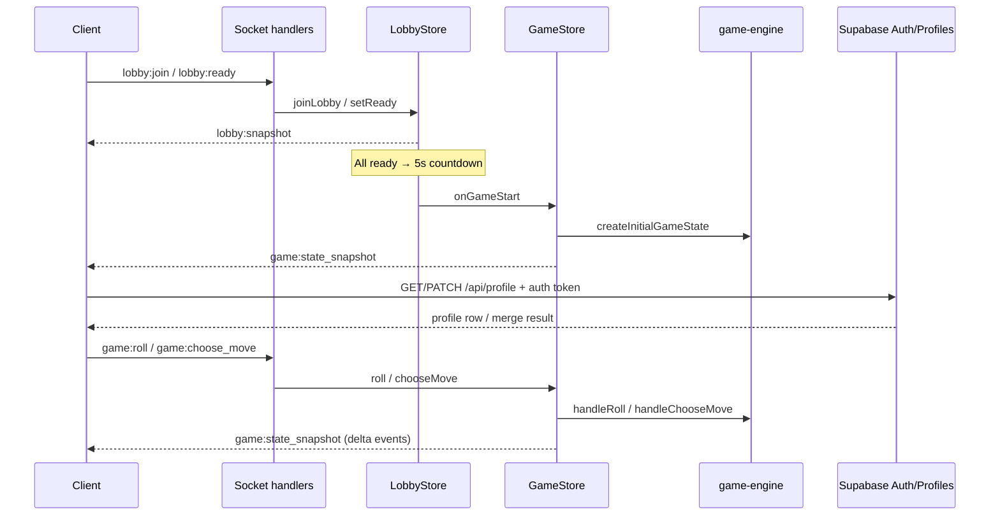

# Server architecture

## Source layout

```
apps/server/src/
├── index.ts              # Fastify + Socket.IO bootstrap
├── http/
│   ├── auth.ts           # Link anon profile into signed-in account
│   ├── matchmaking.ts    # Matchmaking queue + routes
│   ├── profile.ts        # Public profile fetch + owner update
│   └── rooms.ts          # GET/POST /api/rooms
├── socket/handlers.ts    # All lobby:* and game:* socket handlers
├── lobby/lobby-store.ts  # Lobby lifecycle, ready/countdown, host actions
├── game/game-store.ts    # Game sessions; delegates to game-engine
└── lib/
  ├── auth.ts           # Bearer token parsing + Supabase user lookup
    ├── join-code.ts      # 8-char case-sensitive codes
  ├── password.ts       # Lobby password hashing
  └── supabase-server.ts # Admin client for auth/profile routes
```

## Data flow



## Socket rooms

| Room name | Members | Purpose |
|-----------|---------|---------|
| `lobby:{lobbyId}` | Players in that lobby | `lobby:snapshot`, countdown, `lobby:game_started` |
| `game:{gameId}` | Players in that match | `game:state_snapshot` |

On `game:join`, the socket also joins `game:{gameId}`.

## GameStore behavior

- **`roll`:** calls `handleRoll` → may auto-resolve when there is exactly one legal move (single snapshot with roll + resolve events).
- **`chooseMove`:** calls `handleChooseMove` for `waiting_choice` with multiple legal moves.
- **`onChange`:** emits `game:state_snapshot` with **`events` = delta** since the previous state (not full history).
- **`onFinished`:** emits final snapshot, then `lobbyStore.resetAfterGame`.

## LobbyStore highlights

- **2–4 players** per lobby (`LOBBY_MAX_PLAYERS = 4`, min 2 to start).
- **Join:** `lobbyId` or **8-character `joinCode`** (case-sensitive); optional password.
- **Start:** when every connected player is **ready** and has a color, status → `countdown` (5 seconds), then game starts automatically.
- **Host** can cancel countdown, kick, update settings (name/password), transfer host.
- **Disconnect:** marks player disconnected; cancels countdown; 90s grace (`LOBBY_DISCONNECT_GRACE_MS`) before removal (see store implementation).
- **Auth-aware joins:** if a Supabase access token is present, room creation and matchmaking prefer the authenticated Supabase user id over the client-generated guest id.

## Matchmaking

`MatchmakingQueue` runs every 1s and forms a private lobby when wait time and queue size match:

| Queue size (≥) | Min wait (seconds) | Players in match |
|----------------|-------------------|------------------|
| 4 | 20 | 4 |
| 3 | 40 | 3 |
| 2 | 60 | 2 |

Matched players receive `lobbyId` + `joinCode` via HTTP status polling.
